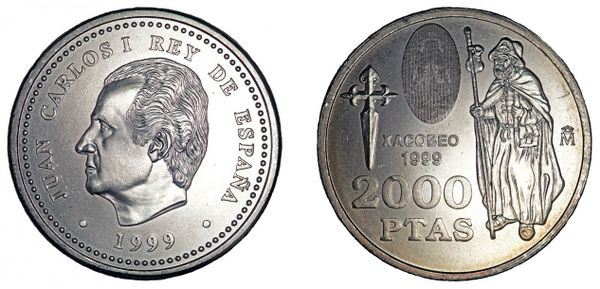

# tutorial

## Introduction @unplugged
1

2

3

4


Use the accelerometer and the screen to build a **Rock Paper Scissors** game that you can play with your friends!

## Step 1 @fullscreen
### Überschrift 1
Add a ``||input:on shake||`` block to run code when you shake the @boardname@.

```blocks
input.onGesture(Gesture.Shake, () => {

})
```
